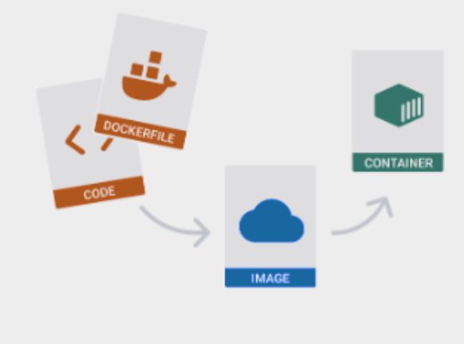
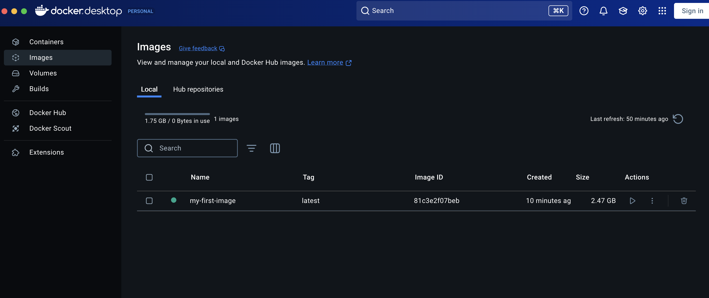
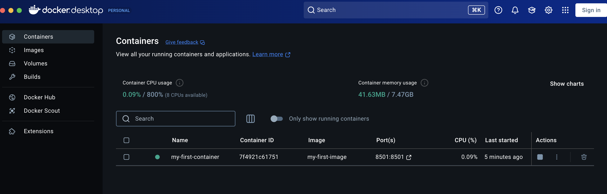
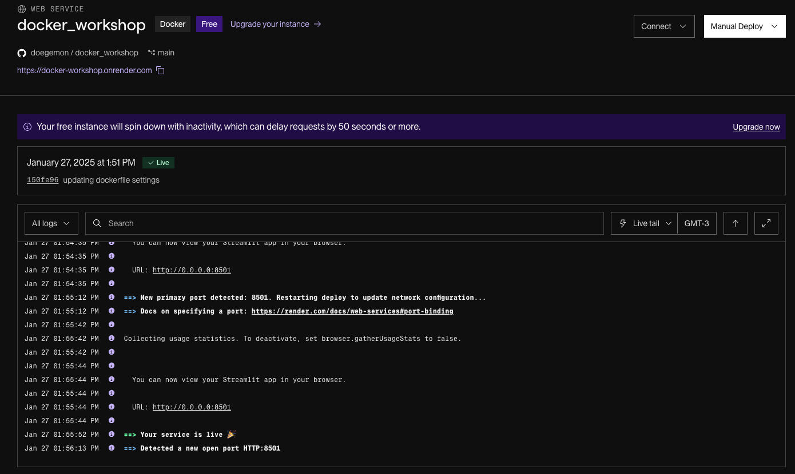
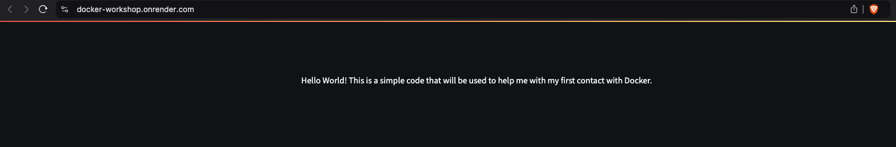

# First Steps with Docker
This is a simple project that I did to start getting used to Docker.

Also, I took the opportunity to use for the first time the `pre-commit` library, a good practice that I want to implement in future projects.

## Docker Basics
Docker is a virtualization platform based on containers, and allows you to create, distribute and run applications in isolated environments (Containers).

One of its main attributes is Reproducibility, allowing the same code to work in the same way on different computers and operating systems.

In summary, Docker works the following way:



First, you write down your code, creating your application or service. Then, you have to create a Dockerfile, which will be responsible for building an Image.

After you build the Image, you can create a Container based on this Image.

## Project Rundown
After starting the project using Poetry and configuring the hooks of the ```pre-commit``` package, I created a very basic Streamlit dashboard so that I could create a Docker Imagem.

As the flow displayed above indicates, then it was necessary to create the ```Dockerfile``` (and also the ```.dockerignore``` file, which works similarly to the ```.gitignore``` file).

Using the command ```docker build``` you can build an Image based on the instructions written down in the ```Dockerfile```, which will appear on the Docker desktop application:



And with the command ```docker run``` you can create a Container based on the Image you previously builded:



In this case, clicking in the IP on the _Port_ section of the Container will open the Streamlit dashboard.

Just to complement, after testing that the application works and all the necessary files hosted in this repository, I deployed the application using Render:





You can check the dashboard trough this link: https://docker-workshop.onrender.com.

## Conclusion and Reference
After understanding the Docker basics and creating the ```Dockerfile```, building an Image, creating a Container and hosting it on Render, I will try to use Docker in my future projects, so that anyone can easily reproduce the results of the application independent of the specs of the computer or operating system.

This project was suggested in the Docker Workshop available on [Jornada de Dados](https://suajornadadedados.com.br/).
